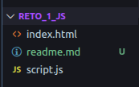

# Resumen Estructurado
### _Nombre del reto_ 🚀


#### ✅ Descripcion del proyecto:
Tienes que transformar un objeto plano de datos de usuario en una estructura organizada que será enviada a una API. Debes aplicar desestructuración con renombramiento, construir nuevos objetos anidados usando spread, y generar un objeto final con una estructura limpia y legible.


Instrucciones:
    Declara un objeto entradaUsuario con las propiedades:
    nombre, apellido, email, telefono, ciudad, pais, activo
    Desestructura las propiedades y aplica renombramiento a:
    email → correo
    telefono → contacto
    Crea un nuevo objeto usuarioFormateado que:
    Agrupe nombre y apellido bajo identidad
    Agrupe correo y contacto bajo contacto
    Incluya un objeto ubicacion con ciudad y pais
    Mantenga la propiedad activo como está
    Use spread para integrar partes del objeto en estructuras nuevas
    Muestra el objeto final en consola.

### Como Ver el reto
1. Clonar el repositorio:
```bash
https://github.com/Anderson-Oloroso/Reto_1_JS.git
```
2. Abrir la carpeta
3. Abrir con el navegador el archivo index.html
4. Abrir la terminal con F12


## 👾 *Archivos del proyecto*



## 💻 *Tecnologías utilizadas*
- HTML5
- CSS3
- JS

## 👤 _Creadores_
#### *Nombre:* <u>Henrik Anderson Oloroso García</u>
#### *Nombre:* <u>Brando Estiben Ixén Teleguario</u>
##### *Ultima modificación:* <u>27 de abril 2026</u> 